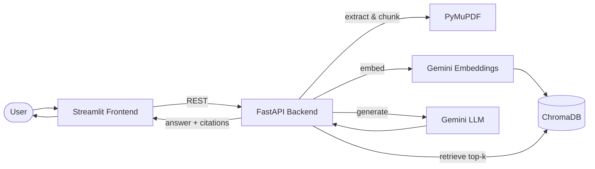

<div align="center">


### Ask your documents anything.

A focused, single-document RAG chatbot — upload a PDF, ask natural-language
questions about it, and get grounded answers with rich, section-level
citations you can actually trust.

[](.)
[](.)
[](.)
[](.)
[](.)
[](.)

</div>

---

## Table of contents

- [What it does](#what-it-does)
- [Highlights](#highlights)
- [How it works](#how-it-works)
- [Architecture & design](#architecture--design)
  - [Design principles](#design-principles)
  - [Why it scales](#why-it-scales)
  - [Key trade-offs](#key-trade-offs)
- [The service layer, in depth](#the-service-layer-in-depth)
- [Tech stack](#tech-stack)
- [Project structure](#project-structure)
- [API reference](#api-reference)
- [Getting started](#getting-started)
- [Configuration](#configuration)
- [Design notes](#design-notes)
- [Future enhancements](#future-enhancements)
- [License](#license)

---

## What it does

Drop in a PDF — a policy manual, a report, a contract — and the app reads
it, indexes it, and lets you have a real conversation with it. Every
answer is grounded strictly in the document's own content, and every
answer comes with a trail of evidence back to the exact page and section
it came from, so you never have to take the chatbot's word for it.

It is deliberately **not** a multi-tenant platform. There are no
accounts, no document libraries, no long-term history. One document is
active at a time, which keeps the system small, fast, and cheap enough
to run comfortably on free-tier infrastructure — while still feeling
like a polished, single-purpose product rather than a stripped-down demo.

## Highlights

**Structure-aware ingestion**
PDF text *and* heading structure are extracted with PyMuPDF, so the app
knows not just what a document says but where it says it — chapter,
section, and sub-section.

**Answers you can verify**
Every response is generated only from retrieved chunks of the source
document — never from the model's general knowledge. Each citation
carries the document title, an ordered heading breadcrumb (e.g.
*HR Policies → Leave Policy → Annual Leave*), a page number, and a
preview snippet of the exact text used, so a claim can always be traced
back to its source in one click.

**Guided conversation**
Five suggested questions are generated the moment a document finishes
indexing — so users know where to start — and five fresh, contextual
follow-ups are generated after every single answer, keeping the
conversation moving without anyone having to think of what to ask next.
Both are produced via Gemini's structured JSON output, not brittle
text parsing.

**One document, zero clutter**
Uploading a new PDF cleanly replaces the last one — its vector index,
its stored file, and its chat history — in a single atomic flow. There's
never a stale document lingering in the background.

**A real interface, not a default Streamlit app**
A custom editorial black-and-cream theme, a proper logo and favicon,
overridden alerts/buttons, and friendly error banners instead of raw
tracebacks. It's built to be shown to a client, not just to a developer.

**Deploy anywhere in minutes**
Fully Dockerized with health checks on both services; runs identically
via `docker compose up` locally or as two container images in the cloud.

## How it works



1. **Upload** — the PDF is parsed for text and heading structure, split
   into overlapping chunks (`RecursiveCharacterTextSplitter`), embedded
   with Gemini, and stored in a single ChromaDB collection. Five
   suggested questions are generated immediately after.
2. **Ask** — the question is embedded and matched against the top 5 most
   relevant chunks by similarity search.
3. **Answer** — the retrieved chunks (each tagged with its title,
   heading breadcrumb, and page) are assembled into context, sent to
   Gemini alongside the recent chat history, and returned with the exact
   chunks that backed the answer as structured citations — plus five new
   contextual follow-up questions.

There is no `session_id` anywhere in the system — state is
process-global by design, not scoped to a user or session. That single
decision is what removes the need for accounts, a relational database,
or Redis, and is the main reason the whole stack stays this light.

## Architecture & design

The backend follows a **strict layered architecture** — a thin API layer
over a rich service layer over a set of infrastructure clients — so that
each concern has exactly one home and can be reasoned about, tested, and
replaced in isolation.

```
┌──────────────────────────────────────────────────────────────┐
│  API layer            api/upload.py · api/chat.py · api/health │  HTTP contract only:
│  (FastAPI routers)    Pydantic request/response, validation,   │  validate → orchestrate →
│                       status codes. No business logic.         │  shape response
├──────────────────────────────────────────────────────────────┤
│  Service layer        PDF · Chunk · Embedding · Vector ·       │  All business logic.
│  (plain classes)      RAG · LLM · Question · State             │  Single-responsibility,
│                       Each does one thing; composed by handlers│  independently testable
├──────────────────────────────────────────────────────────────┤
│  Core / infra         core/config · core/prompts ·             │  Cross-cutting wiring:
│                       core/chroma_client · core/gemini_client  │  clients, settings,
│                       core/exceptions · middleware/logging      │  prompts, error mapping
└──────────────────────────────────────────────────────────────┘
                    ChromaDB (vectors)  ·  Google Gemini (LLM + embeddings)
```

The **golden rule**: the API layer *orchestrates* but never *computes*.
An endpoint like `POST /document` validates the upload, then calls
`PDFService → ChunkService → VectorService → QuestionService` in
sequence and shapes the response — but every actual decision (how a
heading is detected, how a chunk is annotated, how a vector is stored)
lives one layer down. This is what keeps handlers readable at a glance
and makes the business logic unit-testable without spinning up HTTP.

### Design principles

- **Single Responsibility, one service per capability.** Eight services,
  each owning exactly one stage of the pipeline. `PDFService` knows about
  fonts and headings but nothing about vectors; `VectorService` knows
  about ChromaDB but nothing about Gemini prompts. New capabilities slot
  in as new services rather than swelling existing ones.
- **Rich metadata flows forward, no backward lookups.** A chunk is
  stamped with all the metadata a citation will ever need
  (`document_title`, `hierarchy`, `page_number`, `char_start/end`,
  `chunk_index`, `total_chunks`) *at ingestion time*. When a chunk is
  later retrieved, `RAGService` turns it straight into a
  `Citation` — no second database round-trip to "hydrate" the result.
  Retrieval cost is one query, full stop.
- **Dependency inversion at the client boundary.** Gemini and ChromaDB
  are reached only through `core/gemini_client` and `core/chroma_client`
  wrappers. Swapping the vector store or the model provider is a change
  to one file, not a hundred call sites.
- **Fail fast on bad configuration.** The FastAPI `lifespan` handler
  verifies Gemini credentials *and* the ChromaDB connection on startup —
  before the app accepts a single request. A misconfigured deployment
  dies immediately and loudly instead of failing on the first user's
  upload.
- **Structured output over string parsing.** Suggested questions come
  back through Gemini's JSON-schema-constrained output mode
  (`response_mime_type="application/json"`), so the code never
  regex-scrapes free text into a list — the model is contractually
  obligated to return a clean array of strings.
- **The client never sees a stack trace.** Every backend error is mapped
  to a typed exception and a friendly message; raw tracebacks go to logs
  only. (See [Design notes](#design-notes).)

### Why it scales

"Scalable" here means the design has no *architectural* ceiling — the
constraints that exist are deliberate product choices, not accidents,
and each has a clear removal path (see
[Future enhancements](#future-enhancements)).

- **Stateless-by-request compute, horizontally scalable.** The heavy work
  — parsing, embedding, retrieval, generation — holds no
  request-scoped state; it reads from ChromaDB and Gemini and returns.
  Those handlers can run behind N replicas with a shared vector store and
  scale out linearly. In the deployed setup, the container already scales
  on HTTP concurrency.
- **Retrieval cost is bounded and independent of document size.** Answer
  latency is a function of `top_k` (fixed at 5) and the model, *not* of
  how many chunks the document has — a 500-page PDF answers as fast as a
  5-page one, because ANN search over ChromaDB's HNSW index is
  sub-linear. Prompt size is capped (`_MAX_CONTEXT_CHARS`), so cost and
  latency stay predictable regardless of input.
- **The embedding dimension is a deliberate cost lever.** Gemini's
  `gemini-embedding-001` natively returns 3072-dim vectors; we truncate
  to **768** via Matryoshka representation learning (a shorter prefix of
  the vector is still a valid, only-slightly-lower-fidelity embedding).
  That's a **4× cut** in vector storage and RAM for a marginal accuracy
  cost — the single biggest reason this runs comfortably on free-tier
  memory limits.
- **Provider-managed heavy lifting.** No GPUs to provision, no model
  weights to host, no embedding server to babysit — Gemini handles
  inference and embeddings behind an API. Scaling the ML tier is
  Google's problem, not ours.
- **Clean seams for the next tier of scale.** The single-collection,
  single-process assumptions are isolated behind `StateService` and
  `VectorService`. Multi-document / multi-tenant support is "add a
  `document_id` / collection key and a session store," not a rewrite —
  because nothing else in the codebase assumes global state directly.

### Key trade-offs

Every simplification below was a conscious call — **optimize for a
lightweight, single-purpose, free-tier-deployable product** — with a
known cost and a known upgrade path.

| Decision | Why we did it | Trade-off accepted | Upgrade path |
|---|---|---|---|
| **Single active document, no `session_id`** | No accounts, no DB, no Redis — radically simpler ops | Only one document / one conversation at a time | Add `document_id` + per-session collections + auth |
| **In-memory chat history** | Zero persistence infra; history is cheap and disposable | History is lost on restart / not shared across replicas | Back it with Redis or Postgres |
| **Embeddings truncated to 768 dims** | 4× less storage/RAM; fits free-tier limits | Slightly lower retrieval fidelity than full 3072 dims | Raise `EMBEDDING_DIMENSION` (1536 / 3072) |
| **Embedded ChromaDB (on-disk)** | No separate DB service to run or pay for | Vector store co-located with the app process | Point at a ChromaDB server / managed vector DB |
| **Fixed `top_k = 5`, no reranker** | Predictable latency and cost; good enough for single docs | No cross-encoder reranking of retrieved chunks | Add a rerank stage before generation |
| **Heuristic (font-size) heading detection** | Works on any PDF with zero ML, no layout model | Imperfect on unusual layouts; best-effort breadcrumbs | Swap in a layout/OCR model behind `PDFService` |
| **Gemini for LLM + embeddings** | One provider, one key, generous free tier | Vendor coupling to Google | Client wrappers isolate the swap to two files |

## The service layer, in depth

All business logic lives in eight focused services under
`backend/app/services/`. Each is a plain Python class with a single
responsibility, composed by the API handlers — none of them import
FastAPI, so every one is unit-testable in isolation.

### `PDFService` — extraction & structure detection
Turns a raw PDF into per-page text *plus* a detected heading outline
using PyMuPDF. Its cleverness is **font-size-based heading detection**:
it estimates the document's body-text size once, globally, as the
statistical **mode** of every line's font size (headings are rare
outliers, so the mode is far more robust than a mean or a per-page
estimate), then promotes any line meaningfully larger than that
(`_HEADING_SIZE_RATIO`) and short enough to be a real heading
(`_MAX_HEADING_CHARS`) into a heading with a relative `level`. This is
what later makes *"HR Policies → Leave Policy → Annual Leave"*
breadcrumbs possible — with **no ML model and no layout service**. Also
extracts the embedded document title for citations, falling back to the
filename when absent.

### `ChunkService` — structure-aware chunking
Splits page text into overlapping chunks
(`RecursiveCharacterTextSplitter`, `CHUNK_SIZE`/`CHUNK_OVERLAP`) and, in
the same pass, **reconstructs each chunk's heading breadcrumb** by
walking the headings in document order and maintaining a level-keyed
stack. The subtlety: a heading on page 3 still applies to a chunk on
page 5 until a same-or-shallower heading appears — so the `hierarchy`
carries correctly *across* page boundaries. Every chunk leaves this
service fully annotated (`chunk_index`, `total_chunks`, `page_number`,
`char_start/end`, `hierarchy`, `document_title`), so nothing downstream
ever has to look metadata back up.

### `EmbeddingService` — vectorization & the cost lever
Wraps Gemini's embedding model for both documents (indexing) and queries
(retrieval), and enforces the **768-dim Matryoshka truncation** that
keeps the vector store small. Keeping document and query embedding behind
one service guarantees they always use the *same* dimension — a subtle
invariant that silently breaks retrieval if violated.

### `VectorService` — the ChromaDB boundary
Owns every read and write against the single `document_rag` collection.
Uses the **raw `chromadb` client rather than a LangChain wrapper** on
purpose, for direct control of metadata — notably serializing the
`hierarchy` list to a `" > "`-joined string on write (Chroma metadata
must be primitives) and splitting it back on read. Configures the
collection for **cosine space** so `1 − distance` is a valid similarity
score, exposes `similarity_search` returning fully-rehydrated chunks with
scores, and provides the atomic `delete_collection` used on every
replace/reset.

### `LLMService` — the generation boundary
A thin, deliberately "dumb" wrapper over Gemini with two modes:
`generate()` for free-text answers and `generate_structured()` for
**JSON-schema-constrained** output. It knows *how* to talk to Gemini but
never *what* to say — callers render prompts from `core/prompts`
templates. That separation keeps prompt engineering in one reviewable
place and the transport layer trivially swappable.

### `RAGService` — the orchestrator of a single answer
The heart of a Q&A turn: retrieve `top_k` chunks → format them into
labeled context (each block tagged with its title, breadcrumb, and page,
so the model can ground itself) → generate an answer with the recent
chat history in scope → assemble citations **directly from the retrieved
chunks** (no second lookup). When `ENABLE_DEBUG_METADATA` is on, it also
surfaces retrieved-chunk counts and similarity scores for retrieval
tuning.

### `QuestionService` — guided-conversation generation
Produces the suggested questions that make the product feel guided: an
initial batch from the freshly-indexed document, and contextual
follow-ups after every answer. It reuses the *already-retrieved* answer
context for follow-ups instead of re-querying the vector store, caps
input size (`_MAX_CONTEXT_CHARS`) to bound cost, and defensively
normalizes the model's JSON into a clean, length-capped `list[str]`.

### `DocumentStateService` — the single source of truth for "now"
The one place holding mutable state: the active document's metadata and
its chat history, in memory, behind a `threading.Lock` and exposed as a
process-wide singleton (`@lru_cache`) so state survives across requests.
It bounds history to `MAX_CHAT_HISTORY_TURNS`, and cleanly separates
`clear()` (wipe everything) from `clear_history()` (keep the document,
drop the conversation) — the backend half of the deliberate
"Clear Chat" vs "Clear Current Document" distinction.

## Tech stack

| Layer | Technology |
|---|---|
| Backend | FastAPI, Python 3.11 |
| LLM | Google Gemini (`gemini-3.1-flash-lite`) |
| Embeddings | Google Gemini (`gemini-embedding-001`, truncated to 768 dims via Matryoshka representation learning) |
| Vector store | ChromaDB (persistent, embedded, single collection) |
| Orchestration | LangChain (chunking), `google-generativeai` (LLM + embeddings) |
| PDF parsing | PyMuPDF |
| Frontend | Streamlit, custom CSS theme |
| Packaging | Docker, docker-compose |

## Project structure

```
rag/
├── backend/
│   ├── app/
│   │   ├── api/            # FastAPI route handlers (document, chat, health)
│   │   ├── services/       # PDF, chunking, embeddings, vector store, RAG, LLM, questions, state
│   │   ├── models/         # Pydantic request/response schemas
│   │   ├── core/           # Config, prompts, Chroma/Gemini client wiring, exceptions
│   │   ├── middleware/     # Request logging
│   │   ├── utils/          # Logging setup, constants, input validators
│   │   └── main.py         # App factory, lifespan checks, CORS, routers
│   ├── uploads/             # Active PDF (gitignored, volume-mounted)
│   ├── chroma_db/           # ChromaDB storage, collection "document_rag" (gitignored, volume-mounted)
│   ├── logs/                # Rotating log files (gitignored, volume-mounted)
│   ├── requirements.txt
│   ├── .env.example
│   └── Dockerfile
│
├── frontend/
│   ├── app.py               # Streamlit entry point: page config, CSS, routing
│   ├── views/                # Top-level screens: upload_view.py, chat_view.py
│   ├── components/           # sidebar, chat_window, uploader, citation, suggested_questions, error_banner, header
│   ├── services/              # api_client.py -- HTTP client for the backend REST API
│   ├── core/                   # Frontend config (backend URL, timeouts, display labels)
│   ├── utils/                   # Constants + formatting helpers
│   ├── assets/                   # custom.css, logo/favicon
│   ├── .streamlit/config.toml
│   ├── requirements.txt
│   ├── .env.example
│   └── Dockerfile
│
├── docker-compose.yml
├── .gitignore
└── README.md
```

## API reference

All routes are under `API_V1_PREFIX` (default `/api/v1`), except `/health`.

| Method | Path | Description |
|---|---|---|
| `POST` | `/document` | Upload a PDF; replaces the active document and returns `{filename, pages, chunks, status, suggested_questions}` in one call. |
| `GET` | `/document` | Return the active document's info, or `null`. |
| `DELETE` | `/document` | Clear the active document, its index, and its chat history. |
| `POST` | `/chat` | Ask a question; returns `{answer, citations, suggested_questions, debug?}`. |
| `GET` | `/chat/history` | Return the full conversation history. |
| `DELETE` | `/chat/history` | Clear only the chat history — the document and its index are untouched. |
| `GET` | `/health` | Liveness + live Gemini/ChromaDB connectivity check. |

Interactive docs (Swagger UI) are available at `http://localhost:8000/docs`
once the backend is running.

## Getting started

### 1. Configure environment variables

```bash
cp backend/.env.example backend/.env      # then set GEMINI_API_KEY
cp frontend/.env.example frontend/.env
```

See [Configuration](#configuration) below for what each variable does.

### 2. Run with Docker (recommended)

```bash
docker compose up --build
```

- Backend: http://localhost:8000 (docs at `/docs`, health at `/health`)
- Frontend: http://localhost:8501

### 3. Run locally without Docker

```bash
# Backend
cd backend
python -m venv venv && venv\Scripts\activate   # Windows
pip install -r requirements.txt
uvicorn app.main:app --reload

# Frontend (separate terminal)
cd frontend
python -m venv venv && venv\Scripts\activate
pip install -r requirements.txt
streamlit run app.py
```

## Configuration

Key backend (`backend/.env`) settings:

| Variable | Default | Notes |
|---|---|---|
| `GEMINI_API_KEY` | *(required)* | Startup fails fast if missing/invalid. |
| `GEMINI_MODEL_NAME` | `gemini-3.1-flash-lite` | Any current Gemini model your API key has access to. |
| `EMBEDDING_MODEL_NAME` | `models/gemini-embedding-001` | |
| `EMBEDDING_DIMENSION` | `768` | Truncated via Matryoshka representation learning (native size is 3072; 1536/768 are Google's validated smaller sizes). Smaller = less ChromaDB storage/RAM — chosen for free-tier hosting. Query and document embeddings must always use the same dimension. |
| `MAX_UPLOAD_SIZE_MB` | `20` | |
| `ALLOWED_FILE_EXTENSIONS` / `ALLOWED_MIME_TYPES` | `.pdf` / `application/pdf` | |
| `CHUNK_SIZE` / `CHUNK_OVERLAP` | `1000` / `200` | Passed to LangChain's `RecursiveCharacterTextSplitter`. |
| `MAX_CHAT_HISTORY_TURNS` | `10` | Bounds in-memory chat history. |
| `ENABLE_DEBUG_METADATA` | `false` | When `true`, `POST /chat` includes a `debug` block (retrieved chunk count + similarity scores) for tuning retrieval quality. Must stay `false` in production. |
| `CORS_ORIGINS` | `http://localhost:8501` | Comma-separated, or `*`. |

Frontend (`frontend/.env`) settings mostly mirror the backend for display
purposes and client-side hints only — the backend is always the source of
truth and re-validates everything server-side.

## Design notes

**Single active document, no sessions.** There is no `session_id`
anywhere in the API or the code — state is process-global, not scoped to
a user or session. Uploading a new PDF always replaces the previous one:
the existing Chroma collection is deleted, the previous file is removed
from disk, chat history is cleared, and the new PDF is parsed, chunked,
embedded, and indexed from scratch. Chat history lives in memory only,
for the lifetime of the running backend process — intentional, to keep
the app lightweight and deployable on free hosting tiers with no
database dependency.

**`views/`, not `pages/`.** Screens live in `frontend/views/`
(`upload_view.py`, `chat_view.py`) rather than a directory literally
named `pages/`, because Streamlit auto-detects a `pages/` folder next to
the entry script and injects its own multipage navigation — which would
fight the custom sidebar and doesn't fit here anyway (the app switches
between upload/chat automatically based on state, it's not user-driven
page navigation).

**No emoji, no default Streamlit look.** The UI follows an editorial
black/cream visual theme (`assets/custom.css`, `.streamlit/config.toml`)
with a logo mark and matching favicon, plain text labels instead of
emoji icons, and Streamlit's default alert/button styling overridden
throughout.

**Errors never show a raw traceback.** `services/api_client.py` wraps
every backend call in `BackendAPIError` (with a `kind` and
`status_code`); `components/error_banner.py` maps that to a friendly
message. `app.py` also wraps the whole render in a last-resort
try/except, and `.streamlit/config.toml` sets `showErrorDetails = "none"`
as a final backstop — full tracebacks always still print to the terminal
running `streamlit run`, just never to the browser.

**"Clear Chat" vs "Clear Current Document."** Clear Chat calls `DELETE
/chat/history` (keeps the document and its index); Clear Current
Document calls `DELETE /document` (wipes everything). They are
deliberately separate controls.

## Future enhancements

The architecture was built so that today's deliberate simplifications
have clean upgrade paths. The most impactful next steps, roughly in
priority order:

**1. RAGAS evaluation harness** — Wire in [RAGAS](https://docs.ragas.io)
to measure retrieval and answer quality with objective metrics:
*faithfulness* (is the answer grounded in the retrieved context?),
*answer relevancy*, *context precision*, and *context recall*. This
turns retrieval tuning (chunk size, `top_k`, embedding dimension) from
guesswork into a measurable, regression-tested process — and gives the
client a defensible quality number rather than a vibe. Runs naturally on
the existing `ENABLE_DEBUG_METADATA` hooks, which already expose
retrieved chunks and similarity scores.

**2. OCR for scanned / image-based PDFs** — Today `PDFService` reads the
text layer via PyMuPDF, so a scanned document (images of text, no
embedded text) yields nothing. Add an **OCR fallback**: detect when a
page has no extractable text and route it through an OCR engine
(Tesseract, or a vision model) before chunking. Because extraction is
fully encapsulated in `PDFService`, this is a change behind one
interface — nothing downstream needs to know how the text was obtained.

**3. Multi-document, multi-session, multi-user auth** — The single
biggest capability leap, and the one the codebase is most deliberately
staged for. Introduce:
   - `document_id` on chunks + a **collection-per-document** (or
     metadata-filtered) scheme in `VectorService`, lifting the
     one-document limit.
   - A **session store** (Redis / Postgres) behind `StateService` so
     chat history persists across restarts and is shared across
     horizontally-scaled replicas.
   - **Authentication & authorization** (JWT / OAuth) so documents and
     conversations are scoped per user, with proper tenant isolation.

   None of these touch the retrieval or generation logic — they're
   additive, precisely because no service today reaches around
   `StateService`/`VectorService` for global state.

**4. Cross-encoder reranking** — Insert a rerank stage between retrieval
and generation: over-fetch (e.g. `top_k = 20`), then rerank with a
cross-encoder and keep the best 5. Meaningfully sharpens answer grounding
on longer, denser documents, at a modest latency cost.

**5. Streaming responses** — Stream tokens from Gemini to the UI
(Server-Sent Events) so answers render progressively instead of arriving
all at once — a large perceived-latency win on longer answers.

**6. Broader ingestion & observability** — Support DOCX/PPTX/HTML/Markdown
(again, behind `PDFService`'s interface), and add structured tracing
(OpenTelemetry) plus a metrics dashboard for retrieval quality and
latency in production.

## License

Proprietary — all rights reserved. This codebase and its contents are
confidential and intended solely for the commissioning client.
